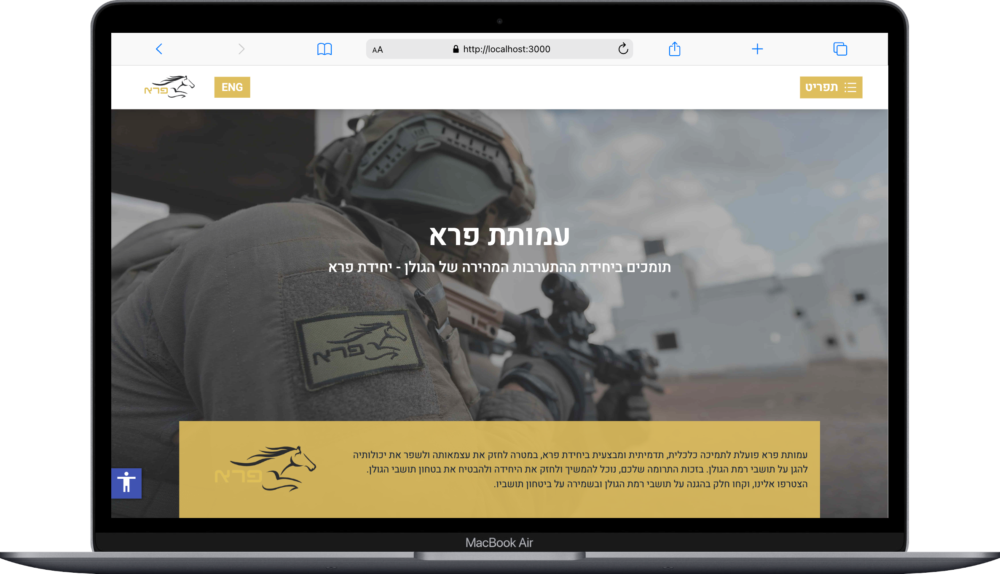

# Pereh Unit Organization – Landing Page

A fully responsive landing page for the **Pereh Unit Organization**, built with **React.js**, **Tailwind CSS**, and **EmailJS**. The website showcases the unit's mission, values, and contact form to connect with visitors.

---

## ✨ Features

- 🌐 Fully responsive layout (mobile-first design)
- 💌 Contact form integrated with EmailJS for direct email submissions
- ⚡ Fast and lightweight
- 🎨 Styled with Tailwind CSS for modern design
- ⚛️ Built using React functional components

---

## 🛠 Tech Stack

| Tech           | Used For                 |
|----------------|--------------------------|
| React.js       | Component-based frontend |
| Tailwind CSS   | Styling and responsiveness |
| EmailJS        | Email submission from contact form |
